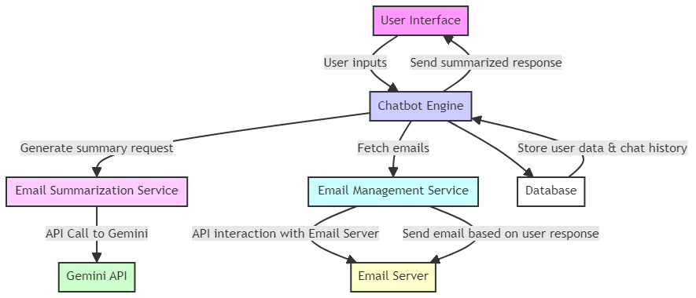

# google-AI-hackathon UA Labs

<h2>Our Team</h2>
<ul>
    <li><strong><a href="https://www.linkedin.com/in/muhammad-hafiz-azhari">Muhammad Hafiz Azhari</strong></li>
    <li><strong><a href="https://www.linkedin.com/in/quocdinh-ford4/">Quoc (Ford) Dinh</strong></li>
    <li><strong><a href="https://www.linkedin.com/in/yashdeepdadiala/">Yashdeep Singh Dadiala</a></strong></li>
</ul>

<h2>Overview</h2>

This project aims to provide users with a convenient way to interact with an email-based assistant through a chat interface. The chatbot serves as an intermediary between the user and their email inbox, summarizing received emails and allowing users to reply with short sentences. The bot then handles the sending of appropriate email responses based on user input.

<h2>Features</h2>
<ul>
    <li><strong>Email Summarization:</strong> The chatbot summarizes received emails, providing users with concise information.</li>
    <li><strong>Chat Interface:</strong> Users can interact with the email assistant through a simple chat interface.</li>
    <li><strong>Email Integration:</strong> The bot sends and receives emails on behalf of the user, facilitating seamless communication.</li>
    <li><strong>User Replies:</strong> Users can reply to emails directly within the chat interface using short sentences.</li>
</ul>

<h2>Technologies Used</h2>
<ul>
    <li><strong>Gemini API:</strong> Utilized for creating the chat interface and handling user interactions.</li>
    <li><strong>Python:</strong> Used for backend logic, email handling, and integration with the Gemini API.</li>
    <li><strong>Email Handling Module:</strong> Python module responsible for fetching, summarizing, and sending emails.</li>
    <li><strong>Gemini Integration Module:</strong> Python module handling communication with the Gemini API for chat functionality.</li>
</ul>

<h2>Software Architecture</h2>

The software architecture of the system involves the following components:

<ol>
    <li><strong>Gemini API Integration:</strong> The Gemini Integration Module interacts with the Gemini API to provide the chat interface. It handles user messages, forwards them to the appropriate handlers, and displays responses from the email assistant.</li>
    <li><strong>Email Handling Module:</strong> This module integrates with the user's email account, fetching new emails, summarizing their content, and preparing responses based on user interactions.</li>
    <li><strong>Backend Logic:</strong> Python scripts manage the overall logic of the system, orchestrating communication between the Gemini Integration Module and the Email Handling Module. This includes handling user inputs, triggering email actions, and managing the flow of conversation.</li>
    <li><strong>Database:</strong> Optionally, a database can be utilized to store user preferences, conversation history, and other relevant data.</li>
</ol>

<h2>Setup Instructions</h2>
<ol>
    <li>Clone the repository to your local machine.</li>
    <li>Install necessary dependencies using <code>pip install -r requirements.txt</code>.</li>
    <li>Configure email account credentials in the Email Handling Module.</li>
    <li>Set up Gemini API credentials and configure the Gemini Integration Module.</li>
    <li>Run the backend Python scripts to start the email assistant.</li>
    <li>Access the chat interface through the provided URL to start interacting with the assistant.</li>
</ol>

<h2>License</h2>

This project is licensed under the <a href="LICENSE">Apache-2.0 license</a>.

</body>
